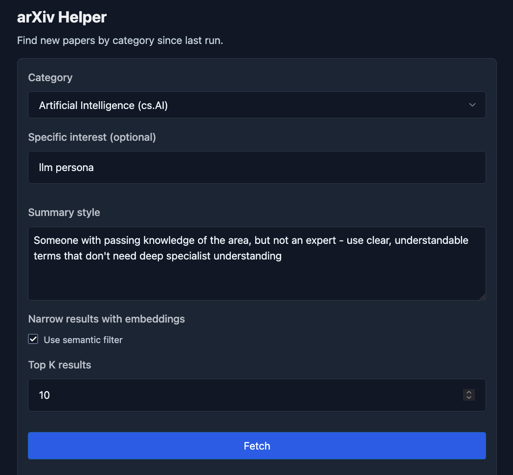
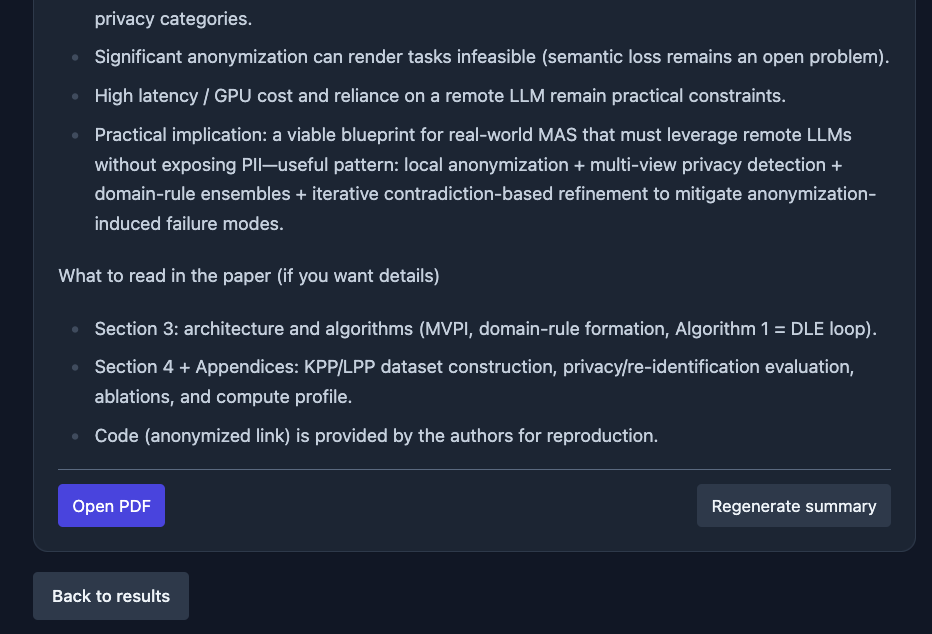

arXiv Helper (FastHTML)
=======================

A smart arXiv paper discovery and summarization tool that helps researchers stay on top of the latest papers in their field.

## Features

### Core Functionality

- **Smart Paper Discovery**: Fetch latest papers from any arXiv category since your last check
- **Semantic Filtering**: Find relevant papers using AI-powered similarity search, not just keywords
- **Batch Processing**: Select multiple papers and download/summarize them all at once
- **AI Summaries**: Generate customizable summaries using OpenAI's latest models
- **Local Storage**: All PDFs, extracted text, and summaries saved locally for offline access
- **Session Memory**: Automatically tracks what you've already seen to show only new papers

### Advanced Features

- **Customizable AI Settings**:
  - **Verbosity Control**: Choose summary length (Low/Medium/High) - from bullet points to detailed analysis
  - **Reasoning Depth**: Control analysis thoroughness (Minimal/Low/Medium/High) - affects both quality and generation time
  - These settings can be adjusted per-session and apply to both new summaries and regeneration

- **Semantic Interest Filtering**:
  - Uses ChromaDB vector embeddings for intelligent paper matching
  - Finds conceptually related papers even without exact keyword matches
  - Example: Searching for "machine learning" also finds papers about "deep learning", "neural networks", etc.
  - Embeddings cached locally in `.chroma/` for fast subsequent searches

- **Smart Regeneration**:
  - Regenerate any summary with different verbosity/reasoning settings without re-downloading
  - Test different summary styles to find what works best for each paper
  - Original PDFs and extracted text are preserved

- **Historical Browser**:
  - Browse all previously downloaded papers through the `/previous` route
  - Filter by date range to revisit papers from specific time periods
  - Re-apply interest filters to past downloads
  - Regenerate old summaries with updated AI settings

- **Persistent Preferences**:
  - All settings (summary style, verbosity, reasoning, top K results) saved between sessions
  - Per-category memory: each arXiv category maintains its own preferences
  - Last-fetch timestamps ensure you never miss papers or see duplicates

### Screenshots

Quickstart (uv)
---------------

1) Install uv (if not already):

   - macOS/Linux: `curl -LsSf https://astral.sh/uv/install.sh | sh`
   - Windows (PowerShell): `irm https://astral.sh/uv/install.ps1 | iex`

2) Install Python 3.13 and create a venv:

   - `uv python install 3.13`
   - `uv venv`  (creates `.venv/`)
   - `source .venv/bin/activate` (Windows: `./.venv/Scripts/activate`)

3) Install dependencies from `pyproject.toml`:

   - `uv sync`  (or `uv pip install -e .`)

4) Export your OpenAI API key:

   - `export OPENAI_API_KEY=sk-...`

5) Run the app:

   - `uv run uvicorn main:app --reload --port 8000`
   - Then open http://127.0.0.1:8000 in your browser.

Notes
-----

- Downloads and outputs are saved under `papers/<YYYYmmdd-HHMMSS>/`.
- Last-run timestamps per category are saved in `state.json`.
- Tailwind is loaded via CDN; no build step needed.
- If you prefer not to call OpenAI, leave `OPENAI_API_KEY` unset; the app will skip summaries.
- This project prefers `uv` for dependency management and running.

Category cache (optional)
-------------------------

- A local cache of arXiv subject categories is stored at `data/arxiv_categories.json`.
- The repo includes a small seed set; you can refresh from arXiv’s taxonomy page with:
  - `python scripts/fetch_categories.py` (writes to `data/arxiv_categories.json`)
  - `python scripts/fetch_categories.py --stdout` to print JSON without writing
- Notes:
  - This scrapes the public taxonomy page (there’s no official endpoint listing all categories).
  - If the page structure changes, the script may need small tweaks.
