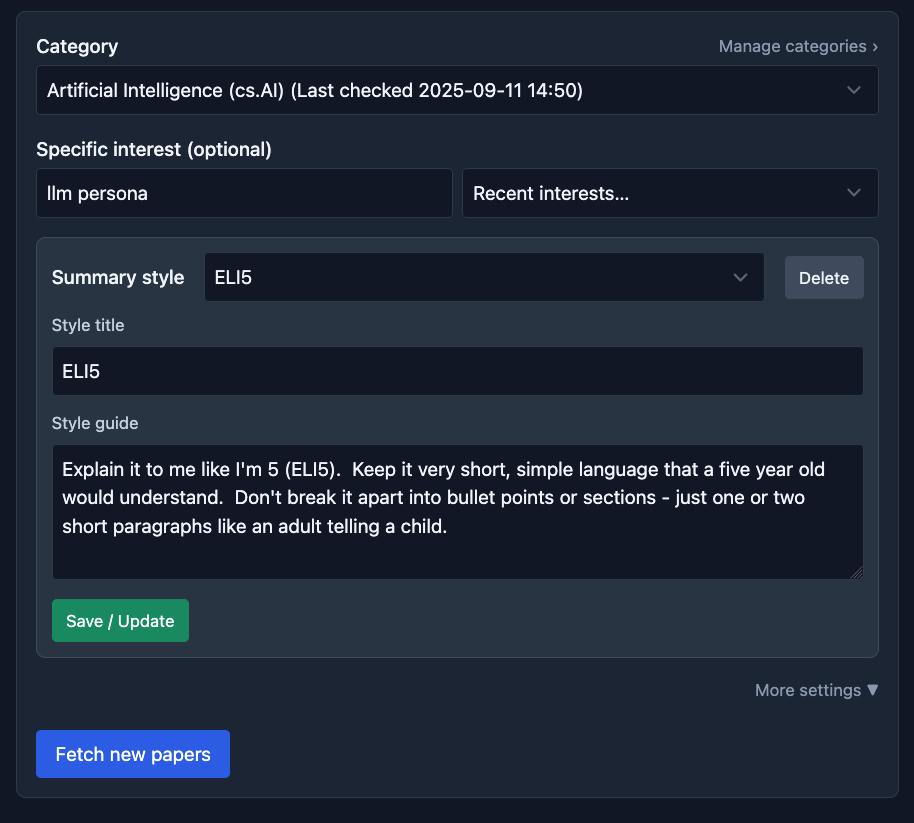

arXiv Helper (FastHTML)
=======================

Simple web app to:

- Pick an arXiv category and optional interest filter
- Fetch papers since your last run (defaults to 1 week on first run)
- Review titles/abstracts and select papers
- Download PDFs locally and extract text
- Summarize each paper with OpenAI `gpt-5-mini`

### Screenshots

Quickstart (uv)
---------------

1) Install uv (if not already):

   - macOS/Linux: `curl -LsSf https://astral.sh/uv/install.sh | sh`
   - Windows (PowerShell): `irm https://astral.sh/uv/install.ps1 | iex`

2) Install Python 3.13 and create a venv:

   - `uv python install 3.13`
   - `uv venv`  (creates `.venv/`)
   - `source .venv/bin/activate` (Windows: `./.venv/Scripts/activate`)

3) Install dependencies from `pyproject.toml`:

   - `uv sync`  (or `uv pip install -e .`)

4) Export your OpenAI API key:

   - `export OPENAI_API_KEY=sk-...`

5) Run the app:

   - `uv run uvicorn main:app --reload --port 8000`
   - Then open http://127.0.0.1:8000 in your browser.

Managing dependencies (uv)
--------------------------

- Add a dependency: `uv add <package>`
- Remove a dependency: `uv remove <package>`
- Update lockfile (optional): `uv lock` (creates/updates `uv.lock`)
- Re-sync env from lock: `uv sync`

Notes
-----

- Downloads and outputs are saved under `papers/<YYYYmmdd-HHMMSS>/`.
- Last-run timestamps per category are saved in `state.json`.
- Tailwind is loaded via CDN; no build step needed.
- If you prefer not to call OpenAI, leave `OPENAI_API_KEY` unset; the app will skip summaries.
- This project prefers `uv` for dependency management and running.

Category cache (optional)
-------------------------

- A local cache of arXiv subject categories is stored at `data/arxiv_categories.json`.
- The repo includes a small seed set; you can refresh from arXiv’s taxonomy page with:
  - `python scripts/fetch_categories.py` (writes to `data/arxiv_categories.json`)
  - `python scripts/fetch_categories.py --stdout` to print JSON without writing
- Notes:
  - This scrapes the public taxonomy page (there’s no official endpoint listing all categories).
  - If the page structure changes, the script may need small tweaks.
